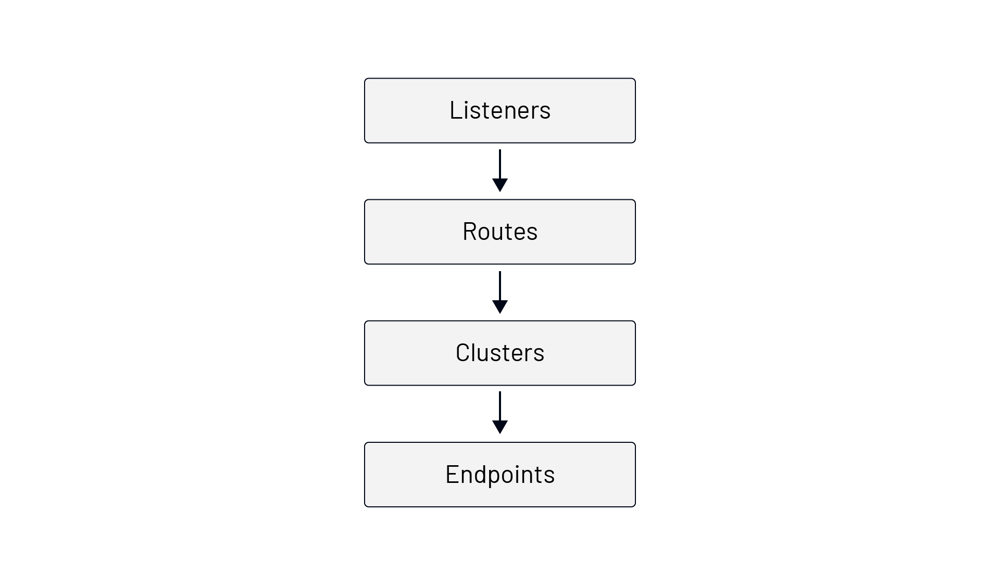
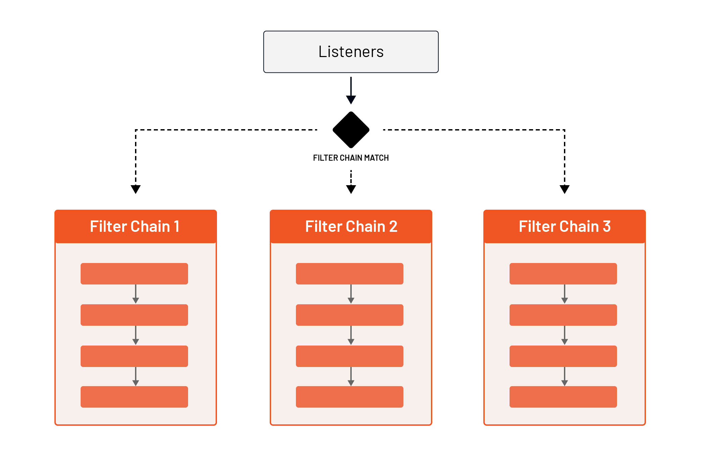
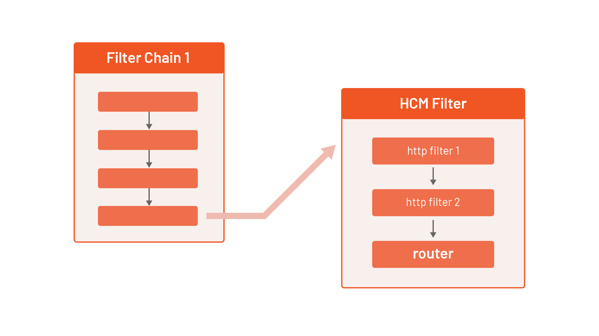

# Envoy Building Blocks

## Overview
Envoy is a high-performance, cloud-native proxy designed for microservices and service mesh architectures. This document provides a **comprehensive** breakdown of Envoy's **building blocks**, explaining its **core components, configurations, and interactions** to help engineers understand its internals and effectively deploy it in their environments.

## Bootstrap Configuration
At the root of an Envoy setup is the **bootstrap configuration**. It defines essential resources and high-level Envoy settings, including:
- Static/Dynamic Resources
- Envoy Instance Names
- Runtime Configuration
- Administrative Interface

Initially, we will focus on **static resources**, later introducing **dynamic resource configurations**.

Envoy generates a variety of **statistics** based on enabled features. These will be referenced throughout this document.

## Envoy Request Flow

Envoy processes network requests through a structured flow:

1. **Listeners** – Accept incoming connections.
2. **Routes** – Define how requests are handled.
3. **Clusters** – Define upstream service groups.
4. **Endpoints** – Individual service instances.

Refer to the **diagram below** for a visual representation of the **Envoy request flow**:



### 1. Listeners
Envoy **listeners** define network locations where it accepts connections (IP:Port or Unix Domain Sockets). When traffic arrives, listeners **route** it through various processing stages.

#### Example Listener Configuration
```yaml
static_resources:
  listeners:
  - name: listener_0
    address:
      socket_address:
        address: 0.0.0.0
        port_value: 10000
    filter_chains: [{}]
```
This defines `listener_0`, which listens on `0.0.0.0:10000` for incoming traffic.

### 2. Filter Chains
Once a listener receives traffic, **Filter Chains** process the request. Filters operate on **different layers**:
- **Listener Filters** – Process headers upon reception.
- **Network Filters** – Work on TCP/UDP packet payloads.
- **HTTP Filters** – Manipulate HTTP requests and responses.

Refer to the **diagram below** for a representation of **filter chains**:



#### Example Filter Chain Selection
```yaml
filter_chains:
- filters:
  - name: envoy.filters.network.http_connection_manager
    typed_config:
      "@type": type.googleapis.com/envoy.extensions.filters.network.http_connection_manager.v3.HttpConnectionManager
      stat_prefix: ingress_http
      http_filters:
      - name: envoy.filters.http.router
        typed_config:
          "@type": type.googleapis.com/envoy.extensions.filters.http.router.v3.Router
```
Here, a **network filter** (`http_connection_manager`) and an **HTTP filter** (`router`) are defined.

### 3. HTTP Connection Manager (HCM)
The **HTTP Connection Manager (HCM)** is a **special** network filter that translates raw data into **HTTP messages** and provides features such as:
- Request/Response Logging
- Header Manipulation
- Route Table Management
- Statistics Collection

Refer to the **diagram below** for how the **HCM filter** integrates into a filter chain:



### 4. Routing Requests
Requests matched in an **HCM filter** are routed based on **virtual hosts** and **routes**.

#### Example Route Configuration
```yaml
route_config:
  name: my_route_config
  virtual_hosts:
  - name: service_host
    domains: ["example.com"]
    routes:
    - match:
        prefix: "/"
      direct_response:
        status: 200
        body:
          inline_string: "Hello from Envoy"
```
- **Virtual Hosts**: Defines routing for `example.com`.
- **Routes**: Matches any request (`/`) and responds with `Hello from Envoy`.

### 5. Clusters
**Clusters** define upstream services to which requests are routed. Each cluster groups multiple **endpoints** (service instances) and supports **load balancing**.

#### Example Cluster Configuration
```yaml
clusters:
- name: service_cluster
  load_assignment:
    cluster_name: service_cluster
    endpoints:
    - lb_endpoints:
      - endpoint:
          address:
            socket_address:
              address: 127.0.0.1
              port_value: 8000
```
- **Cluster Name**: `service_cluster`
- **Endpoint**: `127.0.0.1:8000`

### 6. Endpoints
Each **endpoint** represents a physical instance of a service in a cluster.

## Running Envoy
To run Envoy with the above configuration, install `func-e`:
```bash
curl https://func-e.io/install.sh | sudo bash -s -- -b /usr/local/bin
```
Then, start Envoy with:
```bash
func-e run -c envoy-config.yaml
```

## Load Balancing in Envoy
Envoy supports various **load balancing algorithms**, such as:
- **Round Robin** (default)
- **Maglev**
- **Least Requests**
- **Random**

## Health Checking
Envoy periodically performs **active health checks** to determine if an upstream service is available.

#### Example Health Check Configuration
```yaml
health_checks:
- timeout: 1s
  interval: 5s
  unhealthy_threshold: 3
  healthy_threshold: 2
  http_health_check:
    path: "/health"
```
- **Interval**: Checks every 5 seconds
- **Unhealthy Threshold**: Marks service unhealthy after 3 failures
- **Healthy Threshold**: Restores service health after 2 successes

## Observability in Envoy
Envoy provides deep **observability** with:
- **Logging**
- **Metrics (statsd, Prometheus)**
- **Distributed Tracing (Jaeger, Zipkin, OpenTelemetry)**

#### Example Metrics Configuration
```yaml
admin:
  access_log_path: /dev/null
  profile_path: /var/log/envoy/profile
  address:
    socket_address:
      address: 0.0.0.0
      port_value: 9901
```
- **Metrics are available on `0.0.0.0:9901`**

## Conclusion
This guide introduced the **fundamental building blocks** of Envoy:

| Component       | Purpose |
|----------------|---------|
| **Listeners**  | Accept incoming requests |
| **Filter Chains** | Process requests at network and HTTP levels |
| **HCM Filter** | Converts raw packets into HTTP messages |
| **Routing**    | Directs traffic to upstream services |
| **Clusters**   | Groups upstream services for load balancing |
| **Endpoints**  | Individual instances of services |
| **Health Checks** | Ensure service availability |
| **Observability** | Logging, metrics, and tracing support |

By using these components effectively, developers can **build scalable, resilient, and observable service meshes** powered by Envoy.

