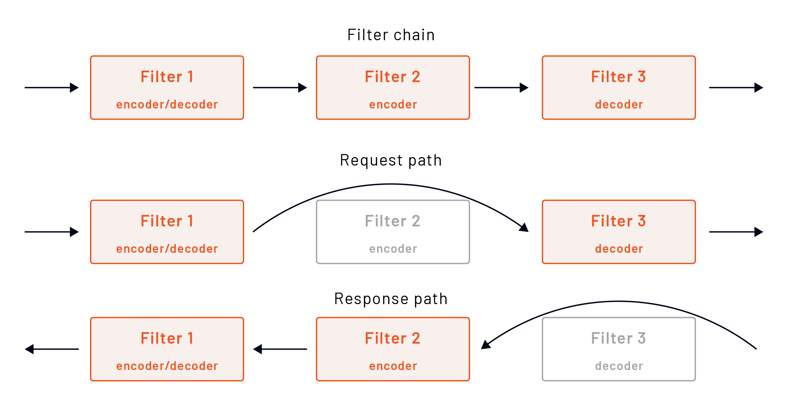

# HTTP Connection Manager (HCM) Introduction

## Overview
The HTTP Connection Manager (HCM) is a **network-level filter** in Envoy that translates raw byte streams into structured HTTP messages and events. It is responsible for handling various HTTP functionalities, including:

- **Access logging**
- **Request ID generation and tracing**
- **Header manipulation**
- **Route table management**
- **Statistics collection**

Envoy’s HCM natively supports **HTTP/1.1, WebSockets, HTTP/2, and HTTP/3 (Alpha)**, making it a flexible and robust component for handling HTTP traffic within a service mesh or API gateway setup.

## HTTP/2 Terminology in Envoy
Envoy was designed as an **HTTP/2 multiplexing proxy**, with its architecture reflecting the core concepts of HTTP/2. To understand how Envoy processes HTTP traffic, it is essential to grasp the following **HTTP/2 components**:

- **Stream:** A bidirectional flow of bytes within a single connection.
- **Message:** A complete sequence of frames that form an HTTP request or response.
- **Frame:** The smallest unit of communication, containing headers, metadata, or payload.

Regardless of the connection type (HTTP/1.1, HTTP/2, or HTTP/3), Envoy **abstracts these protocols** into a common model using its **codec API**, enabling uniform processing of HTTP traffic.

## HTTP Filters in Envoy
Envoy supports **HTTP-level filters** within the HCM. These filters operate **independently of the underlying protocol** and can modify HTTP requests and responses dynamically.

There are three types of HTTP filters:

1. **Decoder Filters**: Process incoming request streams before they reach the upstream service.
2. **Encoder Filters**: Process outgoing response streams before they are sent to the client.
3. **Decoder/Encoder Filters**: Apply modifications to both request and response streams.

### HTTP Filter Execution Order
Envoy applies filters **in a specific order** based on their function:

- **Request Path:** Decoder filters are executed in order (from the first to the last filter in the chain).
- **Response Path:** Encoder filters execute in **reverse order** (from the last to the first filter in the chain).

The image below illustrates this process:

## Data Sharing Between Filters
Filters in Envoy share data using two mechanisms:

1. **Static State** – Immutable data loaded at configuration time.
   - **Metadata**: Key-value pairs stored in Envoy’s configuration (e.g., route settings, cluster info).
   - **Typed Metadata**: Strongly-typed metadata for optimized access.
   - **Per-Route Configuration**: Settings applied at the virtual host or route level.

2. **Dynamic State** – Mutable data created during runtime.
   - Managed via the `StreamInfo` object, allowing filters to store and retrieve runtime state.

## Built-in HTTP Filters
Envoy provides a wide range of built-in HTTP filters for common tasks, including:

- **CORS (Cross-Origin Resource Sharing)**
- **CSRF (Cross-Site Request Forgery) Protection**
- **Health Checks**
- **JWT Authentication**
- **Rate Limiting**

You can find the full list of built-in HTTP filters in the official [Envoy documentation](https://www.envoyproxy.io/docs/envoy/latest/)

## Conclusion
The HTTP Connection Manager (HCM) is a powerful network filter in Envoy that handles HTTP traffic efficiently. By leveraging **HTTP filters, metadata sharing, and dynamic request routing**, HCM enables fine-grained control over API traffic within modern service meshes and cloud-native architectures.