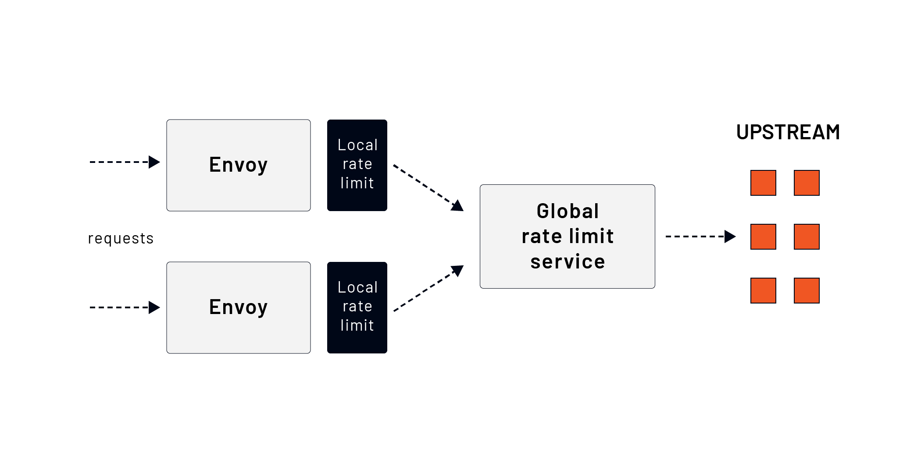

# Rate Limiting Introduction

## Overview
Rate limiting is a strategy used to control the number of requests a client or host can send within a given timeframe. It helps prevent system overload, ensures fair resource distribution, and enhances security by mitigating abuse or DoS attacks. Once a client reaches the defined request threshold, further requests are **rate-limited**—meaning they are rejected before reaching the upstream service.

In addition to rate limiting, Envoy also supports **circuit breakers**, which help prevent excessive load on upstream services and avoid cascading failures.

## Global vs. Local Rate Limiting
Envoy supports two primary types of rate limiting:

1. **Global (Distributed) Rate Limiting**
2. **Local (Non-Distributed) Rate Limiting**

The key distinction is that global rate limiting manages access to shared upstream services across multiple Envoy instances, while local rate limiting applies constraints to individual Envoy instances.

### **Comparison: Global vs. Local Rate Limiting**

| Feature                 | Global Rate Limiting                          | Local Rate Limiting                         |
|-------------------------|---------------------------------------------|--------------------------------------------|
| Scope                   | Shared across multiple Envoy instances      | Applies to a single Envoy instance        |
| Use Case                | Limiting access to a common service (e.g., database) | Preventing excessive local resource usage |
| Implementation          | Requires an external rate limit service (RLS) | Configured directly in Envoy              |
| Flexibility             | Highly configurable, supports complex rules | Simpler and faster, with basic rules      |
| Dependency              | Requires an external rate-limiting service | No external dependency                    |

Both local and global rate limits can be applied **simultaneously** in Envoy, ensuring more effective traffic control. When both are enabled, **local rate limiting** is enforced first, followed by **global rate limiting**.

---
## Next Steps
In the upcoming sections, we will explore:
- **Global rate limiting**: How to configure and integrate Envoy with an external rate-limiting service (RLS).
- **Local rate limiting**: Configuring per-instance rate limiting policies directly within Envoy.

By implementing the appropriate rate-limiting strategy, we can efficiently manage network traffic, prevent service degradation, and enhance system reliability.