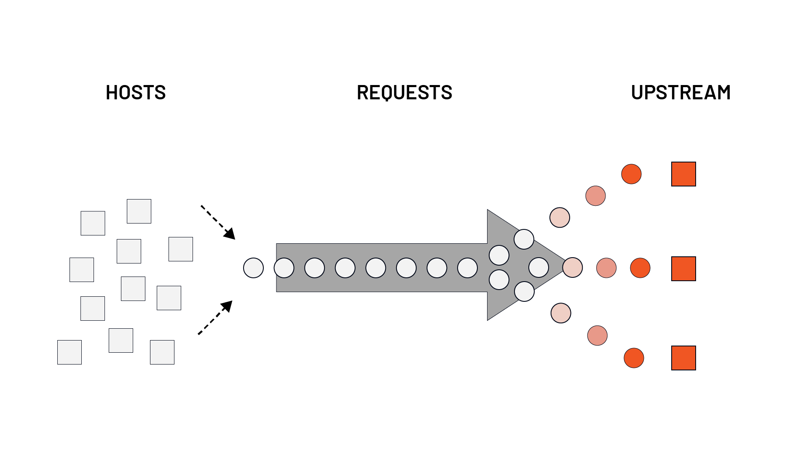
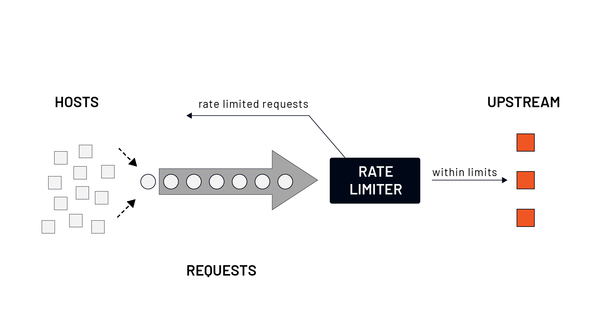
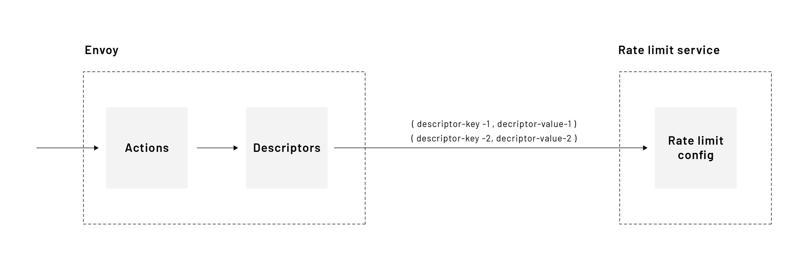
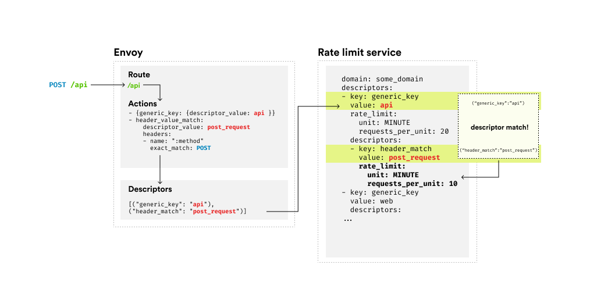

# Global Rate Limiting in Envoy

## Overview
Global rate limiting is a mechanism used to **control the frequency of incoming requests** to a set of upstream services across multiple Envoy instances. It helps prevent upstreams from being overwhelmed, ensuring fair resource allocation and reducing the risk of cascading failures.

Envoy supports **both global and local rate limiting**, which can be applied together:

- **Global rate limiting** (distributed): Controls access to shared upstreams across multiple Envoy instances.
- **Local rate limiting** (non-distributed): Applies limits per Envoy instance.



---
## Why Global Rate Limiting?
Consider a scenario where **many downstream hosts** send requests to a **small number of upstream services**. Without rate limiting, the upstreams might get overwhelmed, leading to degraded performance or even failure.



By implementing global rate limiting, we can:
- Protect upstreams from excessive traffic.
- Maintain service stability under high load.
- Prevent cascading failures.

---
## Envoy and External Rate Limit Service
Envoy integrates with an **external rate-limiting service** that implements a defined RPC/IDL protocol. The reference implementation uses **Go, gRPC, and Redis**.

The Envoy proxy calls this external service, which **tracks and evaluates request quotas** before deciding whether to accept or reject a request.

### High-Level Rate Limiting Concept



The process involves:
1. **Actions:** Defined in Envoy configuration to determine how requests should be evaluated.
2. **Descriptors:** Key-value pairs generated based on the request properties.
3. **Rate Limit Service:** Uses descriptors to apply rate limits based on predefined rules.

---
## Configuring Global Rate Limits
To configure **global rate limits**, two components must be set up:

1. **Client-side (Envoy configuration):** Defines the rate-limiting actions and how requests should be evaluated.
2. **Server-side (Rate Limit Service configuration):** Implements rate-limiting logic and enforces the limits.

Envoy supports two types of rate-limiting filters:
- **Network-level rate limiting:** Invoked per new connection to a listener.
- **HTTP-level rate limiting:** Invoked per request, based on routing rules.

### Rate Limiting Configuration

#### **Envoy Client-Side Configuration**
Below is an example of rate-limiting rules defined at the **virtual host level**:
```yaml
rate_limits:
- actions:
  - header_value_match:
      descriptor_value: get_request
      headers:
      - name: :method
        prefix_match: GET
  - header_value_match:
      descriptor_value: path
      headers:
        - name: :path
          prefix_match: /api
- actions:
  - header_value_match:
      descriptor_value: post_request
      headers:
      - name: :method
        prefix_match: POST
```

In this setup:
- GET requests to `/api` generate the descriptors: `("header_match": "get_request"), ("header_match": "path")`.
- POST requests match `("header_match": "post_request")`.
- These descriptors are sent to the rate limit service.

#### **Full Route-Level Configuration Example**
```yaml
routes:
- match:
    prefix: "/users"
  route:
    cluster: some_cluster
    rate_limits:
    - actions:
      - generic_key:
          descriptor_value: users
      - header_value_match:
          descriptor_value: post_request
          headers:
          - name: ":method"
            exact_match: POST
- match:
    prefix: "/api"
  route:
    cluster: some_cluster
    rate_limits:
    - actions:
      - generic_key:
          descriptor_value: api
      - request_headers:
          header_name: dev
          descriptor_key: dev_request
```

- **Users route:**
  - Limits **POST requests** to `/users` to **10 requests per minute**.
  - Limits all requests to `/users` to **20 requests per minute**.
- **API route:**
  - Limits requests based on the `dev` header value.

#### **Enabling Rate Limit Filter**
```yaml
http_filters:
- name: envoy.filters.http.ratelimit
  typed_config:
    "@type": type.googleapis.com/envoy.extensions.filters.http.ratelimit.v3.RateLimit
    domain: some_domain
    enable_x_ratelimit_headers: DRAFT_VERSION_03
    rate_limit_service:
      transport_api_version: V3
      grpc_service:
          envoy_grpc:
            cluster_name: rate-limit-cluster
```
- The **rate-limit service** is configured as an upstream cluster.
- The **domain** name allows isolation of rate limit rules.
- The `x-ratelimit` headers are enabled for visibility.

---
## Rate Limit Service Configuration
On the **server-side**, we define the **rate limits** based on the descriptors sent by Envoy.

### Example Rate Limit Configuration
```yaml
domain: some_domain
descriptors:
- key: generic_key
  value: users
  rate_limit:
    unit: MINUTE
    requests_per_unit: 20
  descriptors:
  - key: header_match
    value: post_request
    rate_limit:
      unit: MINUTE
      requests_per_unit: 10
- key: generic_key
  value: api
  descriptors:
  - key: dev_request
    value: true
    rate_limit:
      unit: SECOND
      requests_per_unit: 10
  - key: dev_request
    value: false
    rate_limit:
      unit: SECOND
      requests_per_unit: 5
```

- **Requests to `/users`**:
  - **20 requests per minute** (global limit for all users).
  - **10 requests per minute** for `POST /users`.
- **Requests to `/api`**:
  - **10 requests per second** if `dev: true`.
  - **5 requests per second** if `dev: false`.

### How Matching Works
| **Incoming Request** | **Generated Descriptor** | **Rate Limit Applied** |
|----------------------|-------------------------|------------------------|
| GET /users | `("generic_key": "users")` | 20 req/min |
| POST /users | `("generic_key": "users"), ("header_match": "post_request")` | 10 req/min |
| GET /api | `("generic_key": "api")` | No rate limit |
| GET /api, `dev: true` | `("generic_key": "api"), ("dev_request": "true")` | 10 req/sec |
| GET /api, `dev: false` | `("generic_key": "api"), ("dev_request": "false")` | 5 req/sec |

---
## Conclusion
Global rate limiting provides a **centralized** way to manage traffic flow across multiple Envoy instances. By integrating with an external rate-limiting service, we can:
- Protect upstream services from overload.
- Apply fine-grained request limits.
- Maintain system stability under load.

By combining **global** and **local** rate limiting, organizations can build **resilient, scalable**, and **highly available** systems.

