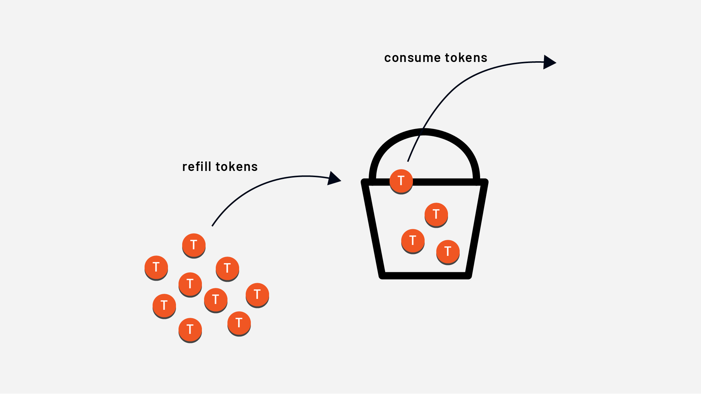
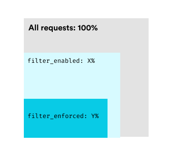

# Local Rate Limiting in Envoy

## Overview
Local rate limiting applies a **token bucket** algorithm to limit incoming requests at the **listener**, **virtual host**, or **route** level. Unlike **global rate limiting**, which is distributed across multiple Envoy instances, local rate limiting is enforced **per Envoy process**.

## Token Bucket Algorithm
The **token bucket algorithm** is a fundamental rate-limiting technique:
1. Tokens are added to a bucket at a fixed rate.
2. A request consumes a token.
3. If the bucket is empty, the request is rejected.



---

## Local Rate Limit Configuration
The **token_bucket** field defines the rate limit settings:
```yaml
token_bucket:
  max_tokens: 5000
  tokens_per_fill: 100
  fill_interval: 30s
```
- `max_tokens`: Maximum tokens in the bucket.
- `tokens_per_fill`: Number of tokens added per interval.
- `fill_interval`: How often tokens are added.

---

## Enabling and Enforcing Local Rate Limits
Envoy allows **enabling** and **enforcing** rate limits separately.

- **filter_enabled**: Percentage of requests where the rate limit is active.
- **filter_enforced**: Percentage of rate-limited requests that are actually rejected.



Example:
```yaml
token_bucket:
  max_tokens: 5000
  tokens_per_fill: 100
  fill_interval: 30s
filter_enabled:
  default_value:
    numerator: 100
    denominator: HUNDRED
filter_enforced:
  default_value:
    numerator: 100
    denominator: HUNDRED
```

---

## Adding Headers for Rate-Limited Requests
You can add headers to rate-limited requests and responses:
```yaml
response_headers_to_add:
  - append: false
    header:
      key: x-local-rate-limit
      value: 'true'
```

---

## Global vs Route-Level Local Rate Limits
### Global Configuration (All Routes)
```yaml
http_filters:
- name: envoy.filters.http.local_ratelimit
  typed_config:
    "@type": type.googleapis.com/envoy.extensions.filters.http.local_ratelimit.v3.LocalRateLimit
    stat_prefix: http_local_rate_limiter
    token_bucket:
      max_tokens: 10000
```

### Per-Route Configuration
```yaml
route_config:
  name: my_route
  virtual_hosts:
  - name: my_service
    domains: ["*"]
    routes:
    - match:
        prefix: "/"
      route:
        cluster: some_cluster
      typed_per_filter_config:
        envoy.filters.http.local_ratelimit:
          "@type": type.googleapis.com/envoy.extensions.filters.http.local_ratelimit.v3.LocalRateLimit
          token_bucket:
            max_tokens: 10000
            tokens_per_fill: 1000
            fill_interval: 1s
          filter_enabled:
            default_value:
              numerator: 100
              denominator: HUNDRED
          filter_enforced:
            default_value:
              numerator: 100
              denominator: HUNDRED
```

---

## Using Descriptors for Advanced Rate Limiting
Descriptors allow **fine-grained** local rate limiting based on request attributes:

### Define Rate Limit Actions
```yaml
route_config:
  name: my_route
  virtual_hosts:
  - name: my_service
    domains: ["*"]
    routes:
    - match:
        prefix: "/"
      route:
        cluster: some_cluster
        rate_limits:
        - actions:
          - header_value_match:
              descriptor_value: post_request
              headers:
              - name: ":method"
                exact_match: POST
          - header_value_match:
              descriptor_value: get_request
              headers:
              - name: ":method"
                exact_match: GET
```

### Configure Descriptors
```yaml
typed_per_filter_config:
  envoy.filters.http.local_ratelimit:
    "@type": type.googleapis.com/envoy.extensions.filters.http.local_ratelimit.v3.LocalRateLimit
    stat_prefix: some_stat_prefix
    token_bucket:
      max_tokens: 1000
      tokens_per_fill: 1000
      fill_interval: 60s
    descriptors:
    - entries:
      - key: header_match
        value: post_request
      token_bucket:
        max_tokens: 20
        tokens_per_fill: 5
        fill_interval: 30s
    - entries:
      - key: header_match
        value: get_request
      token_bucket:
        max_tokens: 50
        tokens_per_fill: 5
        fill_interval: 20s
```

### Explanation:
- **POST requests** (`header_match: post_request`) → **Max 20 tokens, refills 5 every 30s**.
- **GET requests** (`header_match: get_request`) → **Max 50 tokens, refills 5 every 20s**.

---

## Summary
| **Feature** | **Local Rate Limiting** |
|------------|------------------------|
| **Algorithm** | Token Bucket |
| **Scope** | Per Envoy instance |
| **Configuration Levels** | Listener, Virtual Host, Route |
| **Header Support** | Yes (Request & Response) |
| **Fine-Grained Control** | Yes (Descriptors & Actions) |

By combining **local and global rate limiting**, you can effectively manage traffic flow across services while **preventing overloads** and **ensuring stability**.